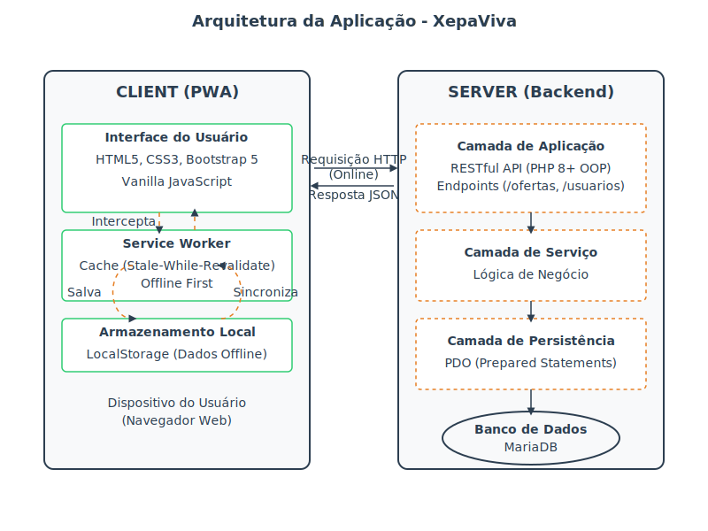
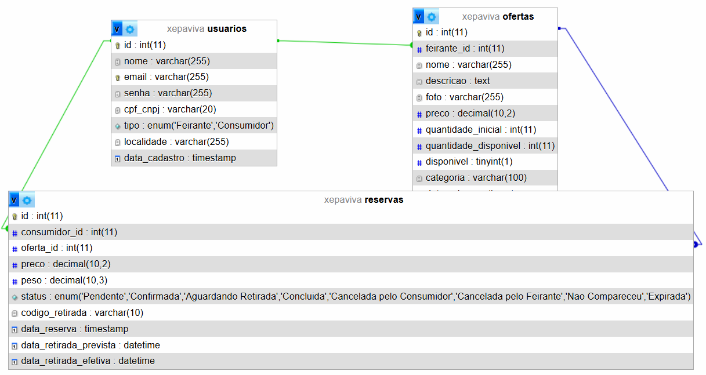

# 📂 Estrutura do Projeto XepaViva

Este documento descreve a organização dos diretórios e arquivos do projeto, explicando o propósito de cada um.

```
/xepaviva
│
├── 📁 analises/                 # Contém laudos e análises técnicas do projeto.
│   └── Analise-20260413.md
│
├── 📁 api/                      # Lógica de negócio do backend (PHP).
│
├── 📁 database/                 # Definição, esquema e diagramas do banco de dados.
│   ├── schema.sql              # Script SQL para criar a estrutura e popular as tabelas.
│   └── schema.png              # Diagrama visual do banco de dados.
│
├── 📁 docs/                     # Documentação oficial do projeto.
│   ├── Jornada.md
│   ├── Project-Structure.md    # Este arquivo.
│   ├── Requisitos.md
│   └── UseCases.md
│
├── 📁 public/                    # Diretório raiz para o servidor web (único ponto de entrada).
│   ├── 📁 assets/               # Arquivos de front-end (CSS, JS, imagens).
│   ├── 📁 api/                  # Ponto de entrada da API (Roteador/Front Controller).
│   │   └── index.php
│   └── index.php               # Página inicial (landing page).
│
├── .gitignore                  # Especifica arquivos a serem ignorados pelo Git.
├── manifest.json               # Manifesto do PWA.
└── sw.js                       # Service Worker (ainda como placeholder).
```

## 🏛️ Arquitetura da Aplicação

A arquitetura do XepaViva é projetada para ser uma Progressive Web App (PWA) robusta, com uma clara separação entre o cliente (frontend) e o servidor (backend), seguindo uma abordagem de *offline-first*.



### Cliente (PWA)

O lado do cliente é construído como uma PWA para garantir uma experiência de usuário rica, responsiva e funcional mesmo sem conexão com a internet.

-   **Interface do Usuário (UI):** Desenvolvida com **HTML5, CSS3, e Bootstrap 5**, focando em uma experiência mobile-first e acessível. A lógica da interface é manipulada por **Vanilla JavaScript**, que interage com o DOM e os serviços do PWA.
-   **Service Worker:** Atua como um proxy entre a aplicação, o navegador e a rede. É responsável por:
    -   **Cache:** Implementa a estratégia *Stale-While-Revalidate* para ativos estáticos (HTML, CSS, JS), servindo-os rapidamente do cache enquanto busca atualizações em segundo plano.
    -   **Offline First:** Permite que a aplicação funcione offline, interceptando requisições e servindo respostas do cache quando a rede não está disponível.
-   **Armazenamento Local (LocalStorage):** Utilizado para persistir dados gerados pelo usuário enquanto offline (como o cadastro de uma nova oferta). Esses dados são mantidos localmente até que a conexão com a internet seja restabelecida, momento em que são sincronizados com o servidor.

### Servidor (Backend)

O backend é uma API RESTful construída em **PHP 8+** puro, seguindo os princípios da Programação Orientada a Objetos (OOP) e uma arquitetura em camadas para garantir desacoplamento e manutenibilidade.

-   **Camada de Aplicação (API):** Expõe os endpoints RESTful (ex: `/ofertas`, `/usuarios`) que o cliente consome. É responsável por receber as requisições HTTP, autenticar o usuário e orquestrar a resposta.
-   **Camada de Serviço:** Contém a lógica de negócio da aplicação. Processa os dados recebidos da camada de API, aplica as regras de negócio (validações, cálculos, etc.) e coordena o acesso aos dados.
-   **Camada de Persistência:** Abstrai a comunicação com o banco de dados. Utiliza a extensão **PDO do PHP com *prepared statements*** para todas as operações de banco de dados, prevenindo vulnerabilidades como SQL Injection.
-   **Banco de Dados:** **MariaDB** é o sistema de gerenciamento de banco de dados escolhido para armazenar todos os dados da aplicação, como usuários, ofertas e reservas.

### Fluxo de Dados

1.  **Online:** O cliente envia requisições HTTP para a API RESTful no servidor. O servidor processa a requisição através de suas camadas e retorna uma resposta em formato JSON.
2.  **Offline:** Quando o cliente está offline, o Service Worker intercepta as requisições.
    -   Para leitura de dados (GET), ele retorna os dados cacheados.
    -   Para escrita de dados (POST, PUT), ele armazena a requisição no **LocalStorage**. Assim que a conexão é restaurada, o Service Worker sincroniza os dados pendentes com o servidor.

## 🗃️ Dicionário de Dados do Banco de Dados

O banco de dados `xepaviva` é o coração do sistema, projetado para armazenar todas as informações críticas sobre usuários, produtos e transações. A modelagem busca consolidar informações e garantir a integridade dos dados através de chaves estrangeiras e restrições.

### Diagrama do Banco de Dados

O diagrama abaixo ilustra a relação entre as tabelas principais.



---

### Tabela: `usuarios`

Armazena informações sobre todos os usuários da plataforma, tanto feirantes quanto consumidores, em um único local para facilitar a autenticação e o gerenciamento.

| Coluna | Tipo | Chave | Descrição |
| :--- | :--- | :--- | :--- |
| `id` | `INT` | PK | Identificador único do usuário. |
| `nome` | `VARCHAR(255)` | | Nome completo do usuário. |
| `email` | `VARCHAR(255)` | Única | Endereço de e-mail para login e comunicação. |
| `senha` | `VARCHAR(255)` | | Senha com hash (bcrypt) para segurança. |
| `cpf_cnpj` | `VARCHAR(20)` | | CPF ou CNPJ, opcional e relevante para feirantes. |
| `tipo` | `ENUM` | | Define o papel do usuário: 'Feirante' ou 'Consumidor'. |
| `localidade`| `VARCHAR(255)` | | Localização do feirante (ex: nome da feira), opcional. |
| `data_cadastro` | `TIMESTAMP` | | Data e hora em que o usuário se cadastrou. |

---

### Tabela: `ofertas`

Contém os detalhes das "xepas" ou kits de produtos anunciados pelos feirantes.

| Coluna | Tipo | Chave | Descrição |
| :--- | :--- | :--- | :--- |
| `id` | `INT` | PK | Identificador único da oferta. |
| `feirante_id` | `INT` | FK (`usuarios.id`) | Identificador do feirante que criou a oferta. |
| `nome` | `VARCHAR(255)` | | Título da oferta (ex: "Kit Tomates Maduros"). |
| `descricao` | `TEXT` | | Descrição detalhada do conteúdo do kit/oferta. |
| `foto` | `VARCHAR(255)` | | URL da imagem de destaque da oferta. |
| `preco` | `DECIMAL(10,2)`| | Preço do kit/oferta. |
| `quantidade_inicial` | `INT` | | Quantidade de kits disponíveis no momento da criação. |
| `quantidade_disponivel`| `INT` | | Quantidade de kits ainda disponíveis para reserva. |
| `disponivel` | `BOOLEAN` | | Status que indica se a oferta ainda está ativa para reserva. |
| `categoria` | `VARCHAR(100)`| | Categoria do produto (ex: "Frutas", "Legumes"). |
| `data_criacao`| `TIMESTAMP` | | Data e hora de criação da oferta. |
| `data_modificacao`| `TIMESTAMP` | | Data e hora da última modificação na oferta. |

---

### Tabela: `reservas`

Registra o vínculo entre um consumidor e uma oferta, formalizando a intenção de compra e gerando as informações para a retirada.

| Coluna | Tipo | Chave | Descrição |
| :--- | :--- | :--- | :--- |
| `id` | `INT` | PK | Identificador único da reserva. |
| `consumidor_id` | `INT` | FK (`usuarios.id`) | Identificador do consumidor que fez a reserva. |
| `oferta_id` | `INT` | FK (`ofertas.id`) | Identificador da oferta que foi reservada. |
| `preco` | `DECIMAL(10,2)`| | Preço da oferta no momento exato da reserva. |
| `peso` | `DECIMAL(10,3)`| | Peso aproximado do kit em kg, se aplicável. |
| `status` | `ENUM` | | O estado atual da reserva no seu ciclo de vida. |
| `codigo_retirada`| `VARCHAR(10)` | | Código único gerado para o consumidor apresentar na retirada. |
| `data_reserva`| `TIMESTAMP` | | Data e hora em que a reserva foi efetuada. |
| `data_retirada_prevista` | `DATETIME` | | Data e hora previstas para a retirada do produto. |
| `data_retirada_efetiva`| `DATETIME` | | Data e hora em que o produto foi efetivamente retirado. |
