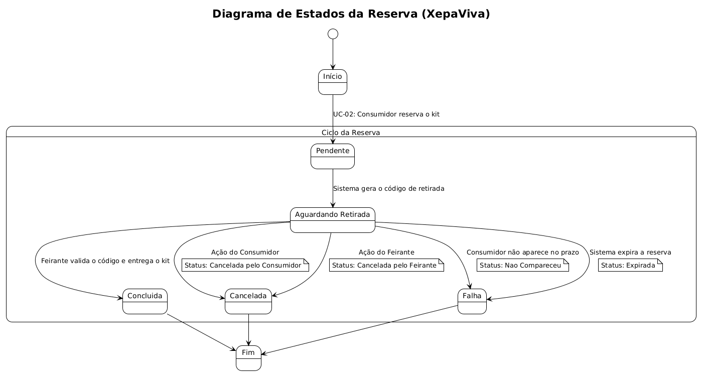

# 🔄 Ciclo de Vida da Reserva (Diagrama de Estados)

Este documento detalha a máquina de estados finitos que governa a entidade `Reserva` no sistema XepaViva. A classe `Reserva` encapsula não apenas os dados de uma reserva, mas também o seu estado atual e as transições válidas entre os estados.

Compreender este ciclo de vida é fundamental para a correta implementação das regras de negócio, tanto no backend (controlando a lógica) quanto no frontend (apresentando a informação correta ao usuário).

## Diagrama de Estados

O diagrama a seguir, gerado a partir do arquivo `States.uml`, ilustra visualmente todas as transições possíveis no ciclo de vida de uma reserva.

---

## Descrição dos Estados

Cada reserva no sistema existe em um dos seguintes estados, definidos no campo `status` da tabela `reservas`.

| Estado | Descrição |
| :--- | :--- |
| **Pendente** | Estado inicial e transitório após a solicitação do consumidor. O sistema está validando e criando a reserva. |
| **Aguardando Retirada**| O estado principal da reserva. A reserva foi confirmada, o item foi separado e o sistema aguarda que o consumidor se apresente para a retirada com o código. |
| **Concluida** | Estado final de sucesso. O consumidor retirou o produto e o feirante confirmou a entrega. A transação está completa. |
| **Cancelada pelo Consumidor** | Estado final de falha. O consumidor desistiu da reserva antes do momento da retirada. |
| **Cancelada pelo Feirante** | Estado final de falha. O feirante, por algum motivo (ex: item danificado), cancelou a reserva. |
| **Nao Compareceu** | Estado final de falha. O consumidor não apareceu para retirar o produto no prazo estipulado. |
| **Expirada** | Estado final de falha. A reserva foi cancelada automaticamente pelo sistema após um tempo limite, sem a retirada. |

---

## Descrição das Transições de Estado

As mudanças de estado são acionadas por ações de usuários (Consumidor, Feirante) ou do próprio Sistema.

| De (Origem) | Para (Destino) | Acionador (Trigger) | Caso de Uso Associado |
| :--- | :--- | :--- | :--- |
| `(Início)` | `Pendente` | Consumidor clica em "Reservar Kit". | UC-02 |
| `Pendente` | `Aguardando Retirada` | Sistema cria a reserva com sucesso e gera o código de retirada. | UC-02 |
| `Aguardando Retirada` | `Concluida` | Feirante valida o código de retirada apresentado pelo consumidor. | UC-02 (FA02.3) |
| `Aguardando Retirada` | `Cancelada pelo Consumidor` | Consumidor seleciona a opção de cancelar a reserva na sua área. | UC-02 (FA02.1) |
| `Aguardando Retirada` | `Cancelada pelo Feirante` | Feirante seleciona a opção de cancelar uma reserva associada a ele. | UC-02 (FA02.2) |
| `Aguardando Retirada` | `Nao Compareceu` | Feirante marca manualmente que o consumidor não apareceu. | UC-02 (FA02.4) |
| `Aguardando Retirada` | `Expirada` | **(Automático)** - O sistema (via cron job ou lógica similar) invalida a reserva após o tempo limite. | (Lógica de Sistema) |
