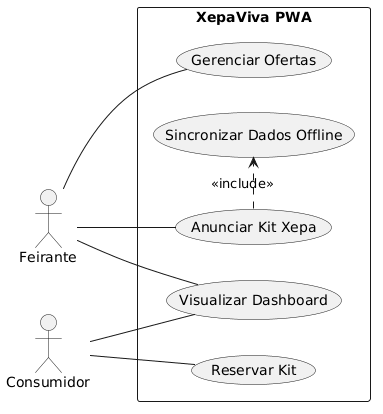

# 🎭 Casos de Uso (Use Cases) do XepaViva

Este documento detalha as interações funcionais entre os atores (Feirante, Consumidor) e o sistema XepaViva.

---

## 1. Atores

*   **Feirante:** Indivíduo ou entidade que comercializa produtos em feiras livres. Seu objetivo é maximizar as vendas e reduzir o desperdício de alimentos, transformando excedentes em lucro. (Persona: Seu Benedito).
*   **Consumidor:** Indivíduo ou membro de organização que busca adquirir alimentos de qualidade por um preço acessível, motivado por economia, sustentabilidade ou necessidade social. (Persona: Mariana).

*(Nota: A autenticação bem-sucedida é uma pré-condição geral para todos os casos de uso que envolvem os atores Feirante e Consumidor.)*

## 2. Diagrama de Casos de Uso

O diagrama a seguir oferece uma representação visual das interações entre os atores e as principais funcionalidades do sistema XepaViva. Ele serve como um mapa funcional, ilustrando o escopo e as fronteiras da aplicação de forma clara e objetiva.

*Figura 1: Diagrama de Casos de Uso do XepaViva.*

## 3. Especificação dos Casos de Uso

**UC-01: Anunciar Kit Xepa**
*   **Atores:** Feirante.
*   **Resumo:** Permite ao feirante criar uma oferta de produtos excedentes (xepa) que ficará visível para os consumidores na plataforma.
*   **Pré-condição:** O kit de alimentos a ser anunciado foi montado e ainda não possui um anúncio ativo na plataforma.
*   **Fluxo Principal:**
    1.  O Feirante seleciona a opção "Cadastrar Oferta" ou "Anunciar Xepa".
    2.  O sistema exibe um formulário para preenchimento dos detalhes do kit.
    3.  O Feirante preenche os campos do formulário (Nome, Preço, Peso, etc.).
    4.  O Feirante submete o formulário.
    5.  O sistema valida os dados.
    6.  Se o Feirante estiver offline, o sistema armazena o anúncio no `LocalStorage` com um status "Pendente de Sincronização" e informa ao usuário que a publicação será concluída ao reconectar. (ver UC-05)
    7.  Se online, o sistema armazena o anúncio no banco de dados com o status "Disponível".
    8.  O sistema exibe uma mensagem de sucesso.
*   **Pós-condição:** Um novo anúncio de kit xepa está disponível (online) ou pendente de sincronização (offline).
*   **Fluxos Alternativos:**
    *   **FA01.1 - Cancelar Anúncio:** A qualquer momento antes de submeter (Passo 4), o Feirante pode selecionar a opção "Cancelar". O sistema descarta os dados e retorna à tela anterior.
*   **Fluxos de Exceção:**
    *   **FE01.1 - Falha na Validação (Passo 5):** Se os dados forem inválidos (e.g., preço negativo, nome em branco), o sistema não prossegue, exibe o formulário novamente destacando os campos com erros e suas respectivas mensagens de correção.
    *   **FE01.2 - Falha de Comunicação (Passo 7):** Se o Feirante estiver online, mas a comunicação com o servidor falhar, o sistema deve tratar a situação como um cenário offline: armazena os dados no `LocalStorage` e informa ao Feirante sobre a falha e a ação de contingência.

**UC-02: Reservar Kit**
*   **Atores:** Consumidor.
*   **Resumo:** Permite que um consumidor encontre e reserve um kit de alimentos para retirada futura.
*   **Pré-condição:** Existe pelo menos um kit com o status "Disponível" na plataforma.
*   **Fluxo Principal:**
    1.  O Consumidor navega pela lista de kits disponíveis.
    2.  O Consumidor seleciona um kit de interesse para ver os detalhes.
    3.  O Consumidor aciona a opção "Reservar Kit".
    4.  O sistema realiza uma verificação final de disponibilidade.
    5.  O sistema atualiza o status do kit para "Reservado", associando-o ao ID do Consumidor.
    6.  O sistema gera um comprovante de reserva (e.g., um código de retirada) para o Consumidor.
    7.  O sistema notifica o Feirante sobre a nova reserva.
*   **Pós-condição:** O kit selecionado está associado ao Consumidor, e o Feirante é notificado da reserva.
*   **Fluxos Alternativos:**
    *   **FA02.1 - Desistir da Reserva:** Após ver os detalhes (Passo 2), o Consumidor pode optar por não reservar e voltar à lista de kits.
*   **Fluxos de Exceção:**
    *   **FE02.1 - Kit Indisponível (Passo 4):** Se, no momento da confirmação, outro consumidor já tiver reservado o kit, o sistema informa ao Consumidor que o item não está mais disponível, atualiza a interface e sugere outros kits semelhantes.
    *   **FE02.2 - Falha na Reserva (Passo 5):** Se ocorrer um erro no servidor ao tentar atualizar o status do kit, o sistema informa ao Consumidor que não foi possível concluir a reserva no momento e sugere tentar novamente. O status do kit não deve ser alterado.

**UC-03: Gerenciar Ofertas**
*   **Atores:** Feirante.
*   **Resumo:** Permite ao Feirante visualizar, editar ou remover os anúncios que ele publicou.
*   **Pré-condição:** O Feirante possui um ou mais anúncios (kits) com status "Disponível" ou "Reservado".
*   **Fluxo Principal (Remover Oferta):**
    1.  O Feirante acessa a seção "Minhas Ofertas".
    2.  O sistema exibe a lista de todos os anúncios do Feirante.
    3.  O Feirante seleciona a opção "Remover" em uma oferta com status "Disponível".
    4.  O sistema solicita uma confirmação para evitar remoção acidental.
    5.  O Feirante confirma a remoção.
    6.  O sistema remove o anúncio do banco de dados.
*   **Pós-condição:** A oferta não está mais visível para os consumidores.
*   **Fluxos Alternativos:**
    *   **FA03.1 - Editar Oferta (inicia no Passo 3):** O Feirante seleciona "Editar". O sistema o direciona para o formulário de anúncio (UC-01) pré-preenchido com os dados da oferta.
    *   **FA03.2 - Cancelar Remoção (Passo 5):** O Feirante decide não remover a oferta e cancela a operação. O sistema retorna à lista de ofertas.
*   **Fluxos de Exceção:**
    *   **FE03.1 - Tentar Remover Oferta Reservada (Passo 3):** Se o Feirante tentar remover uma oferta com status "Reservado", o sistema exibe uma mensagem informando que não é possível remover uma oferta já reservada e sugere entrar em contato com o consumidor se necessário.

**UC-04: Visualizar Dashboard de Impacto**
*   **Atores:** Feirante, Consumidor.
*   **Resumo:** Apresenta um painel visual com métricas sobre o impacto gerado pelo uso do aplicativo.
*   **Pré-condição:** Nenhuma. O dashboard pode ser visualizado a qualquer momento.
*   **Fluxo Principal:**
    1.  O usuário acessa a seção "Painel" ou "Dashboard".
    2.  O sistema coleta os dados de transações concluídas associadas ao usuário.
    3.  O sistema renderiza os gráficos com os dados coletados (kg de alimentos, R$ economizados).
*   **Pós-condição:** O usuário visualiza seus dados de impacto.
*   **Fluxos Alternativos:**
    *   **FA04.1 - Usuário Sem Transações:** Se o usuário ainda não tiver transações (Passo 2), o sistema exibe o dashboard com os valores zerados e uma mensagem motivacional para realizar a primeira venda ou reserva.

**UC-05: Sincronizar Dados Offline**
*   **Atores:** Sistema.
*   **Resumo:** Garante que as ações realizadas offline sejam enviadas ao servidor ao restabelecer a conexão.
*   **Pré-condição:** O dispositivo recuperou a conexão com a internet E existem ações pendentes no `LocalStorage`.
*   **Fluxo Principal:**
    1.  O sistema detecta o evento de reconexão (`online`).
    2.  O sistema verifica o `LocalStorage` por itens marcados como "Pendente de Sincronização".
    3.  Para cada item, o sistema envia a requisição correspondente para a API do backend.
    4.  Após a confirmação do servidor (HTTP 200/201), o sistema remove o item do `LocalStorage` ou atualiza seu status para "Sincronizado".
*   **Pós-condição:** Os dados do cliente e do servidor estão consistentes.
*   **Fluxos de Exceção:**
    *   **FE05.1 - Falha na Sincronização (Passo 4):** Se o servidor retornar um erro para uma requisição (e.g., HTTP 4xx/5xx), o item não é removido do `LocalStorage`. O sistema pode tentar a sincronização novamente em um momento posterior (e.g., usando uma estratégia de backoff exponencial).
    *   **FE05.2 - Dados Conflitantes (Passo 4):** Se o servidor detectar um conflito (e.g., tentativa de editar um item que foi removido), a API deve retornar um erro específico (e.g., HTTP 409 Conflict). O sistema no cliente deve então marcar o item local como inválido e notificar o usuário, se necessário.
